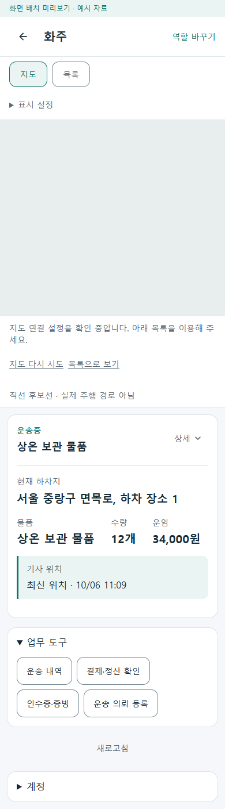
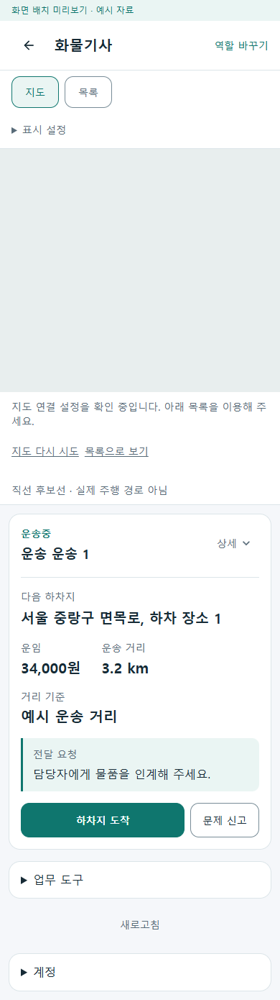
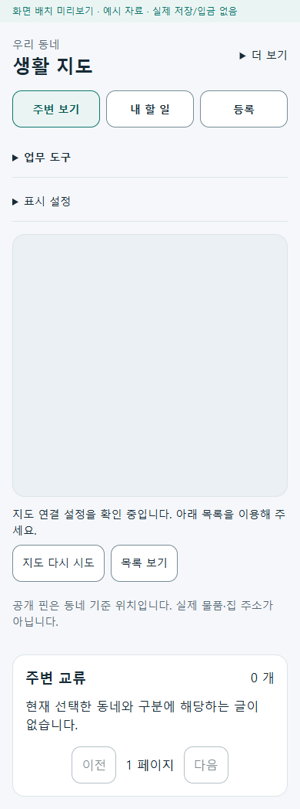
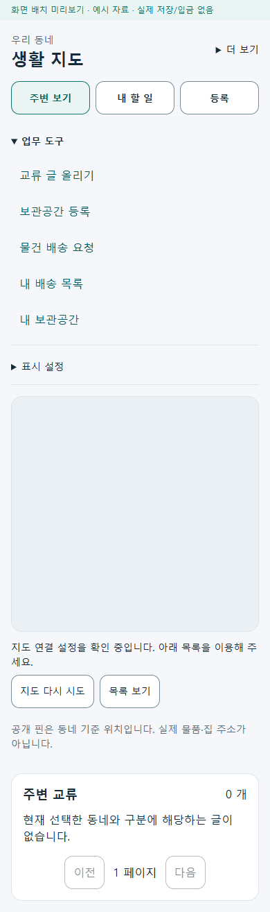
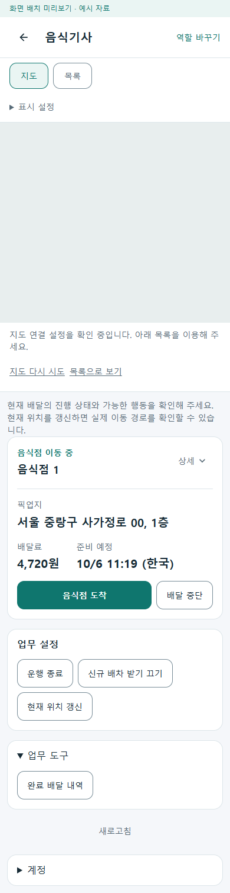
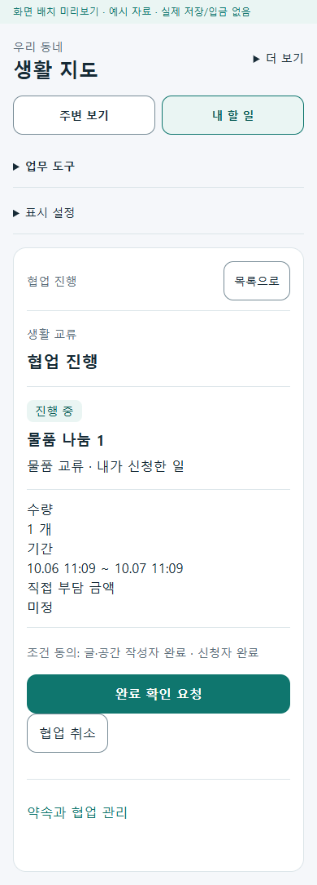

# 역할별 필수 절차와 선택 도구 r22

현재 업무의 수행 버튼과 독립 조회 기능이 함께 나열되던 부분을 정리했다. 현재 절차·조건부 절차·취소/거절/문제 신고는 기본 카드에 두고, 운송내역·증빙 조회·완료 내역 등은 기본으로 접힌 `업무 도구`에서 기존 페이지로 이동한다. 현재 업무가 없으면 새 작업 진입을 바로 제공한다. [구현 전 책임 카드](../ProjectOverview/page-docs/role-map-workspace-r11.md#필수-절차와-선택-도구-r22--구현-전-책임-카드)가 범위를 소유한다.

## 역할별 적용

| 역할 | 바로 표시하는 현재 절차·복구 | 필요할 때 여는 도구 |
| --- | --- | --- |
| 생활 | 현재 협업/배송/공간의 기존 수행·취소·로그인·오류 복구, 주변/내 할 일, 무선택 등록 | 교류 글 올리기, 보관공간 등록, 물건 배송 요청, 내 배송 목록, 내 보관공간 |
| 주문자 | 수령 확인·주문 취소 | 현재 주문 중 추가 음식 주문. 현재 주문이 없으면 음식 주문은 직접 표시 |
| 음식점 | 주문 수락·조리 시작·준비 완료·거절·조리 시간 변경 | 현재 어댑터에 별도 도구 행동이 없어 빈 메뉴를 만들지 않음 |
| 음식 기사 | 제안 수락/거절·가게 도착·픽업·전달·중단, 운행/신규 배차/위치 제어 | 완료 배달 내역 |
| 화주 | 현재 운송 단계·보류·장소·수량·운임 | 운송 내역, 결제·정산 확인, 인수증·증빙, 추가 운송 등록 |
| 화물 기사 | 제안 검토·상차/하차 단계·문제 신고 | 운송 내역 |
| 창고 | 해당 상태의 수령·검수·적치·피킹·포장·인계·출고 진입 | 현재 어댑터에 별도 도구 행동이 없어 빈 메뉴를 만들지 않음 |
| 운영자 | 현재 주문의 배달 중단 검토·오류 복구 | 화물 예외 검토 목록 |

`Required / Conditional / OptionalTool / Unclassified`는 표시 위치만 정한다. 현재 어댑터의 37개 역할·행동 키를 명시적으로 분류하며 `IsPrimary`, route 유무, 활성 여부로 필수성을 추정하지 않는다. 가게 도착은 픽업의 절대 선행 조건이 아니므로 조건부로 분류한다. 필수/조건부는 상세를 접어도 표시하고 미분류는 기존 `IsPrimary || DetailsExpanded` 표시를 보존한다. 개인별 도구 표시 설정은 추가하지 않았다.

종료된 이력의 선택과 진행 중 업무 유무도 구별한다. 화주 adapter의 `IsCurrent`가 선택 여부를 나타내던 한 줄을 종료 여부에 맞췄다. 선택한 의뢰·지도 선택·기존 조회 경로는 유지하며, 종료 이력만 있으면 시작 진입을 직접 표시한다. 미분류 전역 행동은 기존 `추가 작업` 그룹과 강조를 보존한다.

현재 상태의 가능 행동·비활성 사유·확인 절차·기능/권한·서버 재조회는 기존 코드가 유지한다. 조건부 증빙·서명·창고 인계·재조리 요건을 완화하지 않는다. 조회용 증빙/결제 링크는 증빙 제출이나 결제 의무를 뜻하지 않는다. 지도 표시 설정은 운행/배차/GPS 제어와 별개다.

## 페이지 → 코드 → 데이터

- 역할 지도는 `RoleMapWorkspace`와 UI 전용 `RoleWorkspaceActionPolicy`가 표시를 조립한다. 기존 역할 adapter, `RoleWorkspaceViewModel`, `RoleWorkspaceNavigation.WithReturn`이 업무/실행과 선택 복귀를 계속 소유한다. API·JSON·DB schema·정산/요금·인증 권한은 변경하지 않았다.
- 생활은 통합 역할의 실제 `NeighborhoodExchangeMapPage`에 적용한다. 기존 등록과 목록 route, `NeighborhoodMapNavigation.SafeReturn/WithReturn`을 사용한다. Web/MAUI의 생활 배송·공간 목록 wrapper 4개가 `returnUrl`을 공통 컴포넌트에 전달하도록 보완했고 배송 목록의 복귀 문구도 지도 문맥에 맞췄다. 로그인은 기존 독립 화면을 거쳐 같은 목록/선택 지도로 복귀한다.
- 실제 선택 협업의 취소·거절·인계 동의 철회·참여 철회가 기존 접힌 관리 영역에 있던 것도 기본 수행 카드로 옮겼다. 기존 서버 `AllowedActions`와 미확인 요청/전송 중 차단을 보존하고 주 행동과 중복 표시하지 않는다. 조건 수정·이력은 기존 관리 영역에 남긴다.
- 도구 메뉴 열기는 HTML `details` 표시만 바꾼다. 저장·배차·동의·결제 명령을 실행하지 않는다. 현재 업무 카드에 과거 내역이나 독립 입력 폼을 삽입하지 않았다.

## 실제 화면

예시 DTO를 공급하는 로컬 호스트에서 제품 공통 컴포넌트를 렌더했다. 생활은 기존 일반 역할 예시와 달리 실제 생활 지도 컴포넌트와 등록/목록 화면을 사용한다. 지도 키를 공급하지 않아 설정 안내와 목록 대체 상태다. 실제 Google 타일·GPS 근거로 표현하지 않는다.

| 화주 도구 | 화물 기사 현재 업무 |
| --- | --- |
|  |  |

| 생활 기본 화면 | 생활 도구 | 음식 기사 도구 |
| --- | --- | --- |
|  |  |  |

Figma `01 Community` 대응은 생활 지도 도구 메뉴와 기존 독립 등록/목록 진입이다. MAUI `/community/map` 및 기존 역할 지도 route가 같은 공용 Razor/CSS를 소비한다. 이 세션에는 Figma 도구가 없어 frame/node 검증·갱신은 수행하지 못했다. PNG는 공통 웹 렌더이며 MAUI 단말 캡처가 아니다.

## 검증

- Fast `20261006-105830`의 집중 151/151 통과. 추가 검토에서 종료 선택·미분류 전역 행동 보존을 보완한 뒤 최종 Task `20261006-111023`의 `Ssalddel.v3.5.slnx` 빌드와 전수 **7,733/7,733** 통과(실패/건너뜀 0). 이번 신규 64개 시험도 모두 통과했다. 역할 분류, 실제 adapter, 무선택/종료 시작, 미분류 호환, 비활성 사유·외부 경로 차단, 명령 미실행, 생활 업무/로그인/복구를 점검했다.
- 최종 공통 미리보기, 통합 앱 Android·Windows 직접 빌드는 오류/경고 0이다. 전체 solution에는 기존 전문 앱/의존성/nullable 관련 경고가 남지만 빌드는 통과한다. 초기 미리보기 fixture의 반환형 충돌과 MAUI wrapper의 helper import 누락을 수정했고 최종 빌드로 재확인했다.
- `verify-tools-ui.cjs`로 여덟 역할의 실제 공유 UI를 320/390px에서 **30개 화면·22개 흐름** 확인했다. 도구 기본 접힘과 열기 시 현재 업무 불변, 기사 내역/운영 검토의 선택 업무 복귀, 생활 배송/공간 목록의 선택·동네·보기 복귀, 생활 수행/취소의 직접 가시성을 확인했다. 가로 넘침·브라우저 오류 0, 변경 조작의 최소 48 CSS px 터치 영역을 확인했다. 대표 PNG 6개를 보존했다.
- 전체 소유 경로 31개, 구현 검증 범위 21개다. 시작 기준선 960개 중 범위 밖 929개는 해시 일치했다. 작업 중 범위 밖 기존 파일 16개와 신규 파일의 변화도 관찰했으므로 전체 dirty tree가 불변이라고 주장하지 않는다. 이 작업의 수정과 구별해 `preservation.json`에 기록했으며 되돌리거나 stage하지 않았다. 기존 삭제 2개와 HEAD·branch·stage는 유지했다. 최종 로컬 문서 링크 438개 누락 0이다.

원시 로그·TRX·해시·화면 JSON은 Git 제외 `artifacts/local/role-tools-r22/`에 보관한다. 실제 여러 계정의 서버/DB 업무 완주·휴대폰·Azure·입금·Figma·공개 운영은 별도다. commit/push·배포는 수행하지 않았다.
